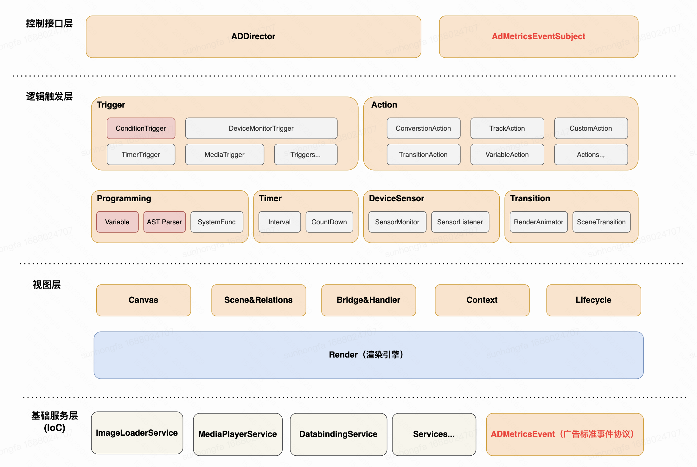
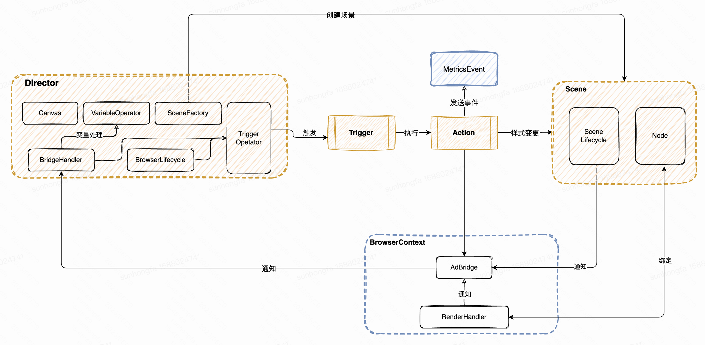

# RIAID

RIAID(Rich Interactive Ad Interface
Definition)，针对富交互广告的解决方案，有B/S架构、高性能、高效率等特点

## 特点说明

### 支持富交互广告定义

对于客户端富交互广告，提供标准定义方式。支持从信息流广告、激励视频、开屏广告等各种形式的广告定义。包含数据埋点、转化跳转、
交互行为定义等。

### 让富交互广告交付周期无限缩短至零

复杂广告传输负载可以小至 1KB 左右，对于传输负载不构成显著性冲击。可以安心使用 Browser-Server 架构，抛弃客户端模板概念。
Per-Ad/Per-Request 形式传输 广告。从而让您的广告可以在最短的时间内，交付到用户设备上。

### 支持 iOS/Android 双端

目前我们已经基于 RIAID 协议，实现了 iOS/Android 上的RIAID引擎：ADBrowser。通过引入 ADBrowser 组件可以快速的让您
的应用具备广告展示能力。同时，也可以降低接入成本，减少版本发布次数

## 功能介绍

我们在做推进客户端广告标准化定义的事情，现在已经基本成型了，也就是 Rich
Interactive Ad Interface Definition （RIAID）协议。
整体来说，我们对于客户端富交互广告，进行了标准化抽象。支持以下能力：

- UI 控制，基于此可以支持 UI 样式的定制化处理
- 自研布局引擎（弹簧盒子模型和钢性系统的相对布局描述）
- Data Binding，基于此可以支持数据替换
- Event Binding，基于此可以支持广告的行为控制
- 分支条件控制（与、或、非），基于这个让 RIAID 具备图灵完备性，可以模拟更复杂的逻辑结构
- 针对广告埋点标准化的 MetricsEvent
- 支持交互行为（单击、双击、长按、摇一摇）
- 对广告的卡片行为进行抽象使用 Director-Scene 模型解决卡片之间流转
- 广告自定义埋点、第三方监控
- 广告落地页定义
同时，针对该协议我们实现了在 iOS、Android 双端的引擎：ADBrowser。并规范了与 Server 之间的架构方式为 BS 架构。
做这些都是为了解决，之前说的客户端广告领域的那个主要矛盾：日益丰富的广告创意与冗长的功能交付周期之间的冲突。 让整体交付
周期无限趋向于零。现在我们可以做到以下几个比较有意思的特性：
- 完整的广告定义能力，辅助广告交付周期无限趋向于零
- 实时渲染，完全由服务器控制客户端广告行为
- 协议网络传输负载控制在 2kb 左右，不会对网络负载造成冲击
- 具备一定的图灵完备性，可以模拟复杂逻辑

## 架构图

## 广告抽象建模分析

- Director负责统筹广告大局，广告中的行为触发都由Director来控制，比如初始化、场景转换等。
- Scene是摆放在广告区域任意位置的场景，场景之间可以有位置关联，比如场景A在场景B的上面，展示的视图由渲染引擎来绘制。
- Trigger由Director来触发，可以有前置条件的触发行为。
- Action由Trigger来执行，两者是绑定关系，Action负责真正的场景切换、事件发送等行为。

以上都是抽象的定义，比如动画Action，是对视图属性变化的声明，像透明度、位置，理论上可以实现所有的属性动画。
正因为这些抽象的定义，可以通过类型组合来实现千变万化的广告可能，从而覆盖海外快手的任意广告形式。
比如说，通过监听运动传感器实现开屏扭一扭；通过定时器，在广告播放第三秒的时候，将某个场景通过贝塞尔曲线动画
移动到指定的位置；我们还可以实现元素共享的复杂动画，这些广告功能都可以通过简单的协议声明就可以实现。

## 已申请专利
- [页面渲染方法、装置、电子设备及存储介质](https://www.incopat.com/detail/init2?formerQuery=iUgqGEWjUQV9WtbjX9smZzlbGWMUeMb7dkC5wfiuCUw%3D&local=zh)
- [动画渲染方法、装置、电子设备及存储介质](https://www.incopat.com/detail/init2?formerQuery=ewz0Mc6WRbJ9ci%2FZjI7QfDlbGWMUeMb7dkC5wfiuCUw%3D&local=zh)
- [一种对象处理方法、装置、电子设备及存储介质](https://www.incopat.com/detail/init2?formerQuery=zEbJ6%2F3NA89uC8gDZsscDTlbGWMUeMb7dkC5wfiuCUw%3D&local=zh)
- [一种事件执行方法、装置、电子设备及存储介质](https://www.incopat.com/detail/init2?formerQuery=%2FIAu5dQxITFfKjh1CDLrajlbGWMUeMb7dkC5wfiuCUw%3D&local=zh)
- [场景画面显示方法、装置、电子设备及存储介质](https://www.incopat.com/detail/init2?formerQuery=KN3gEwYlqk2RdtyOoa8NlDlbGWMUeMb7dkC5wfiuCUw%3D&local=zh)
- [业务更新处理方法、装置、电子设备及存储介质](https://www.incopat.com/detail/init2?formerQuery=sfLJKyv4Dl66SGyLM41U8zlbGWMUeMb7dkC5wfiuCUw%3D&local=zh)
- [一种组件布局方法、装置、电子设备及存储介质](https://www.incopat.com/detail/init2?formerQuery=JdoRGU3KRtGTevnZ88LMQTlbGWMUeMb7dkC5wfiuCUw%3D&local=zh)

## 示例

